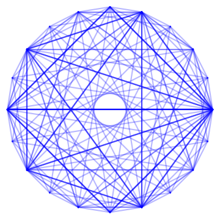

## Fly's Eye (Similar to a DFT Mandala)
Written in C++ using SFML for graphics, this program will draw a "fly's eye":

  It uses vectors for the lines and the number of points calculated can go from 3 to 100, which can be modified by left and right arrows.
There are a lot of unnecessary files but I'm leaving them there because I'm lazy.
